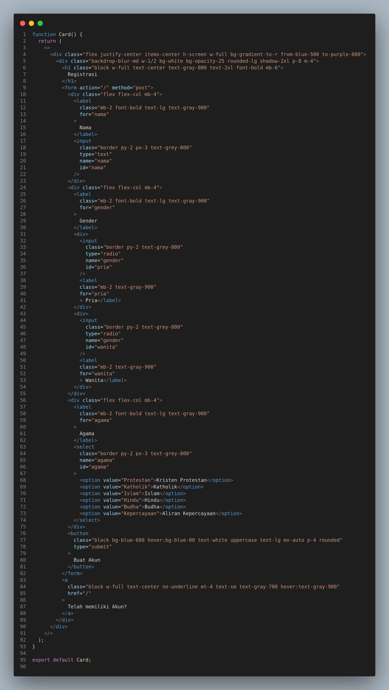
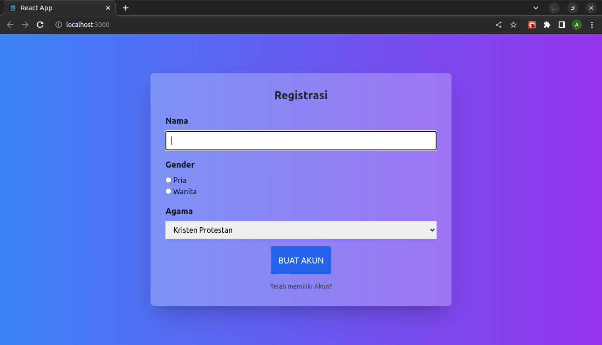

# Pertemuan 1

## 1. Instalasi

Yang Perlu diinstall

#### 1.1. NodeJS

Bisa didownload pada https://nodejs.org/en/download/

Untuk windows pilih versi windows Installer (.MSI) 64 bit secara umum dan 32 bit apabila menggunakan windows 32 bit

#### 1.2. Visual Studio Code

Bisa didownload pada https://code.visualstudio.com/Download sesuaikan dengan sisetem anda

#### 1.3. Visual Studio Code Extesion

1. Web Dev
2. Front-End React Pack

## 2.Membuat Project React Baru

### 2.1. Membuat Folder Workspace

Buatlah sebuah folder dan disarankan huruf kecil dengan nama **kuliah-react**. baiknya berada pada root drive, contoh `c:\kuliah-react` ataupun `d:\kuliah-react`

### 2.2. Menggunakan Create React App

Pada Command Prompt (Baik CMD/Powersehll/Terminal VS Code) pastikan mengarah ke alamat folder workspace (folder workspace menjadi folder root pada command prompt) contoh tampilan dalam command prompt `d:\kuliah-react>`

setelah itu buatlah sebuah project react baru dengan menggunakan perintah **npx create-react-app nama-project** contohya :

`npx create-react-app pertemuan01`

setelah itu buka Visual Studio Code dan pada Menu File > Open Folder pilih folder project yang telah dibuat sebelumnya.

setelah itu tampilkan terminal pada vscode. !!! PASTIKAN ALAMAT TERMINAL BERADA PADA ROOT FOLDER PROJECT YANG DIBUAT !!! contohnya

`d:\kuliah-react\pertemuan01>`

kemudian untuk menjalankan project react ketikkan perintah pada terminal

`npm start`

sehingga akan muncul project react pada browser anda


untuk menghentikan atau stop running aplikasi react, cukup dengan menekan tombol **CTRL** + **C** saat kursor berada di command prompt

# Pertemuan 2

## 1. Buat Project Baru

buatlah project baru dengan menggunakan perintah `npx create-react-app pertemuan02`

## 2. Buat File Hello.js

Dalam Folder **src**, buatlah file dengan nama **Hello.js**

kemudian pada file Hello.js ketikan kode seperti berikut ini

```
function Hello(){
    return(
        <h1>Hello, world</h1>
    );
}
export default Hello;
```

## 3. Integrasikan Hello.js ke index.js

kemudian integrasikan Hello ke dalam Index dengan cara memodifikasi file index.js degan mencari baris code di bawah ini

```
import App from './App';
```

dan diubah menjadi

```
import Hello from './Hello';
```

Setelah itu temukan baris perintah berikut ini

```
root.render(
  <React.StrictMode>
    <App />
  </React.StrictMode>
);
```

dan diubah menjadi

```
root.render(
  <Hello/>
);
```

## 4. Menjalankan Aplikasi

pastikan terminal Anda berada pada root project **pertemuan02** kemudian jalankan perintah **npm start**

dengan hasil sebagai berikut ini


# Pertemuan 3

## 1. Buat Project Baru

buatlah project baru dengan menggunakan perintah `npx create-react-app pertemuan03`

## 2. Buat File Tiga.jsx

Dalam Folder **src**, buatlah file dengan nama **Tiga.jsx**

kemudian pada file Hello.js ketikan kode seperti berikut ini

```
const name = 'Nama Anda';
const element = <h1>Hello, {name}</h1>;
function Tiga(){
    return(
        element
    );
}
export default Tiga;
```

## 3. Integrasikan Tiga.jsx ke index.js

kemudian integrasikan Hello ke dalam Index dengan cara memodifikasi file index.js degan mencari baris code di bawah ini

```
import App from './App';
```

dan diubah menjadi

```
import Tiga from './Tiga';
```

Setelah itu temukan baris perintah berikut ini

```
root.render(
  <React.StrictMode>
    <App />
  </React.StrictMode>
);
```

dan diubah menjadi

```
root.render(
  <Tiga/>
);
```

## 4. Menjalankan Aplikasi

pastikan terminal Anda berada pada root project **pertemuan03** kemudian jalankan perintah **npm start**

dengan hasil sebagai berikut ini


# Pertemuan 4

## 1. Buat Folder Project

Buat sebuah folder project dengan nama **pertemuan04**

## 2. Index

Kemudian dalam folder tersebut buatlah sebuah file dengan nama **index.html** dan ketikan kode berikut ini

```
<!DOCTYPE html>
<html lang="en">
  <head>
    <meta charset="UTF-8" />
    <meta http-equiv="X-UA-Compatible" content="IE=edge" />
    <meta name="viewport" content="width=device-width, initial-scale=1.0" />
    <title>Alex</title>
  </head>
  <body>
<label for="">Nama :</label>
  <br>
   <input type="text"/>
   
  </body>
</html>

```

### 3. Run Live Preivew

Tekan **ctrl** + **shif** + **p** kemudian pilih preview

# Pertemuan 5

# 1. Buat Project React Baru

Buat project react baru dengan perintah npx create-react-app pertemuan05

Pada Command Prompt (Baik CMD/Powersehll/Terminal VS Code) pastikan mengarah ke alamat folder workspace (folder workspace menjadi folder root pada command prompt) contoh tampilan dalam command prompt `d:\kuliah-react>`

setelah itu buatlah sebuah project react baru dengan menggunakan perintah **npx create-react-app nama-project** contohya :

`npx create-react-app pertemuan05`

setelah itu buka Visual Studio Code dan pada Menu File > Open Folder pilih folder project yang telah dibuat sebelumnya.

setelah itu tampilkan terminal pada vscode. !!! PASTIKAN ALAMAT TERMINAL BERADA PADA ROOT FOLDER PROJECT YANG DIBUAT !!! contohnya

`d:\kuliah-react\pertemuan05>

Kemudian pada VS Code

# 2. Install Tailwindcss, PostCSS, dan Autoprefixer

Untuk tampilan kita akan menggunakan Tailwindcss. Pada ReactJs untuk dapat menggunakannya dengan baik perlu diinstall libreary tambahan berupa PostCSS dan Autoprefixer

### 2.1 Install

cara install Tailwindcss, PostCSS, dan Autoprefixer yaitu dengan mengetikan perintah `npm install -D tailwindcss postcss autoprefixer`

### 2.2 Inisialisasi Tailwindcss

cara konfigurasi Tailwindcss yaitu dengan menggunakan perintah `npx tailwindcss init -p` sehingga akan muncul file (digenerate otomatis) dengan nama **tailwind.config.js** pada root project

### 2.3 Konfigurasi Tailwindcss

Buka file **tailwind.config.js** kemudian konfigurasi code tersebut sehingga menjadi seperti berikut ini


### 2.4 Penambahan Directives

Pada file **src/index.css** ubah code menjadi seperti ini


## 3. Membuat Komponen Card

dalam folder src buat file dengan nama **Card.jsx** kemudian ketikkan code seperti ini


## 4. Konfigurasi index

Kemudian lakukan konfigurasi dengan mengubah seluruh isi pada file **src/index.js** seperti code berikut ini


## 5. Run

Kemudian run aplikasi dengan menjalankan perintah `npm start` dengan hasil pada browser seperti berikut ini


## 6. Modifikasi

Silahkan modifikasi Object Card.jsx dengan menambahkan data diri dan foto seperti data KTP (challenge pertemuan 04) kemudian run

# Pertemuan 6

Pertemuan 6 masih menggunakan project pada pertemuan 5.

Yang perlu dilakukan adalah memodifikasi file **Card.jsx** menjadi seperti di bawah ini, dengan kode berikut ini :



kemudian aplikasinya dirunning sehingga tampilannya menjadi seperti di bawah ini :



# Pertemuan 7-8

## 1. Buat Project Baru

silahkan buat project react baru menggunakan *create-react-app*

## 2.Instalasi dan Konfigurasi Tailwindcss

Lihat langkah pertemuan 5, bagian 2. Mulai dari 2.1 - 2.5

## 3. Installasi React-Icons

pada root folder project yang dibuat ketikkan perintah `npm install react-icons`

## 4. Konfigurasi index.css

konfigurasikan index.css yang berada dalam folder **src** sebagai menjadi seperti berikut

```@tailwind base;
@tailwind components;
@tailwind utilities;html {
scroll-behavior: smooth;
}body {
@apply text-lg
}.projects img {
width: 100%;
}/* color */
.bg-primary {
background: #0F172A;
}.bg-secondery {
background: #1E293B;
}.bg-accent {
background: #7477FF;
}.text-accent {
color: #7477FF;
}nav li a {
@apply px-4 py-5 text-lg;
}nav li a:hover {
color: #7477FF;
}.mobile-nav {
@apply fixed block w-full h-full py-2 duration-500 bg-gray-900 md:hidden top-10;
}/* hero */
h1 {
font-family: 'Pacifico', cursive;
line-height: 1.5 !important;
}
```

## 5. Gambar

### 1. Buat Folder Assets

buatlah folder dengan nama **assets** yang berada dalam folder **src**

### 2. Download File Gambar

Dowloadlah seluruh gambar yang ada pada link berikut https://github.com/arpaulustindi/kuliah-react/tree/master/pertemuan07-08/src/assets

Jumlah gambar pada link tersebut adalah 8 gambar

### 3. Include Gambar

Hasil gambar yang didownload, kemudian dipindahkan ke dalam folder assets yang dibuat

## 6. Components

Dalam folder src, buatlah sebuah folder dengan nama **components**. Kemudian dalam folder tersebut silahkan buatlah komponen dengan nama dan syntax berikut

### App.jsx

```
import Header from "./Header";
import Hero from "./Hero";
import About from "./About";
import Projects from "./Projects";
import Blog from "./Blog";
import Contact from "./Contact";
import Footer from "./Footer";

function App() {
  return (
    <>
      <Header />
      <Hero />
      <About />
      <Projects />
      <Blog />
      <Contact />
      <Footer />
    </>
  );
}

export default App;
```

### Header.jsx

```import React, { useState } from "react";
import { AiOutlineMenu, AiOutlineClose } from "react-icons/ai";

const Header = () => {
    const [toggle, setToggle] = useState(false);

    const handleToggle = () => setToggle(!toggle);

    return (
        <header className="fixed z-10 flex justify-between w-full px-5 py-2 text-white bg-primary">
        <a href="/" className="text-2xl font-bold logo text-accent">
            Arifin
        </a>

        {/* Desktop Nav */}
        <nav className="hidden md:block">
            <ul className="flex">
            <li>
                <a href="/#about">About</a>
            </li>
            <li>
                <a href="/#projects">Projects</a>
            </li>
            <li>
                <a href="/#blog">Blog</a>
            </li>
            <li>
                <a href="/#contact">Contact</a>
            </li>
            <li>
                <a href="#resume -link" target="_blank" without rel="noreferrer">
                Resume
                </a>
            </li>
            </ul>
        </nav>

        {/* Mobile Nav */}
        <nav
            className={!toggle ? "mobile-nav left-[-100%]" : "mobile-nav left-0"}
        >
            <ul className="flex flex-col">
            <li>
                <a href="/#about">About</a>
            </li>
            <li>
                <a href="/#projects">Projects</a>
            </li>
            <li>
                <a href="/#blog">Blog</a>
            </li>
            <li>
                <a href="/#contact">Contact</a>
            </li>
            <li>
                <a href="/#resume">Resume</a>
            </li>
            </ul>
        </nav>

        {/* Toggle button */}
        <button onClick={handleToggle} className="block md:hidden">
            {!toggle ? <AiOutlineMenu size={30} /> : <AiOutlineClose size={30} />}
        </button>
        </header>
    );
};

export default Header;
```

### Hero.jsx

```
import React from "react";
import HeroImg from "../assets/hero-img.png";

    import {
    AiOutlineTwitter,
    AiOutlineYoutube,
    AiOutlineFacebook,
    } from "react-icons/ai";

    const Hero = () => {
    return (
        <section className="px-5 py-32 text-white bg-primary">
        <div className="container grid items-center justify-center mx-auto md:grid-cols-2 md:justify-between">
            <div className="pb-5 hero-info md:pb-0">
            <h1 className="text-4xl lg:text-6xl">
                Hi, <br />I am <span className="text-accent">a</span>mrin <br />
                Frontend Developer
            </h1>

            <p className="py-5">
                I am proficient in JavaScript, React.js and Tailwind CSS
            </p>

            <div className="flex py-5 ">
                <a
                href="https://twitter.com/"
                className="inline-block pr-4 text-accent hover:text-white"
                >
                {" "}
                <AiOutlineTwitter size={40} />{" "}
                </a>
                <a
                href="https://www.youtube.com/"
                className="inline-block pr-4 text-accent hover:text-white"
                >
                {" "}
                <AiOutlineYoutube size={40} />{" "}
                </a>
                <a
                href="https://www.facebook.com/"
                className="inline-block pr-4 text-accent hover:text-white"
                >
                {" "}
                <AiOutlineFacebook size={40} />{" "}
                </a>
            </div>

            <a
                href="/#projects"
                className=" btn bg-accent  border-2 border-[#7477FF] text-white px-6 py-3 hover:bg-transparent"
            >
                See Projects
            </a>
            </div>

            <div className="hero-img">
            
            </div>
        </div>
        </section>
    );
};

export default Hero;
```

### About.jsx

```
import React from "react";
import AboutImg from "../assets/about-img.png";

const About = () => {
    return (
        <section className="px-5 py-32 text-white bg-secondery" id="about">
        <div className="container grid items-center justify-center mx-auto md:grid-cols-2 md:justify-between">
            <div className="about-info">
            <h2 className="text-4xl font-bold mb-5 border-b-[5px] w-[180px] border-indigo-600 pb-2">
                About Me
            </h2>

            <p className="pb-5">
                Hi, My Name Is Arifin Tindi. I am a
                Frontend Developer. I build beautifull websites with React and
                Tailwind CSS.
            </p>
            <p className="pb-5">
                I am proficient in Frontend skills like React.js, Redux, Redux Tool
                Kit, Axios, Tailwind CSS, SaSS, Css3 and many more.
            </p>

            <p>In backend I know Node.js, Express.js, MongoDB, and Mongoose</p>

            <p>
                In my spare time I create YouTube videos and write blogs on my Blog.
                Where I talk about programming theory and build various projects.
            </p>
            </div>

            <div className="about-img">
            
            </div>
        </div>
        </section>
    );
};

export default About;
```

### Projects.jsx

```
import React from "react";
import cssProjects from "../assets/cssprojects.png";
import devlog from "../assets/devlog.png";
import getInspirred from "../assets/get-inspirred.png";
import uilogs from "../assets/uilogs.png";


const Projects = () => {
    const projects = [
        {
        img: devlog,
        title: "devlog",
        desc: " A multi author blog. Built with Node.js, MongoDB, React, Redux and Tailwind CSS ",
        live: "https://github.com/arpaulustindi/kuliah-react",
        code: "https://github.com/arpaulustindi/kuliah-react",
        },
        {
        img: uilogs,
        title: "uilogs",
        desc: "Free website template directory for SaaS and Degital Agency. Built with Bootstrap, JQuery and JavaScript",
        live: "https://github.com/arpaulustindi/kuliah-react",
        code: "https://github.com/arpaulustindi/kuliah-react",
        },
        {
        img: cssProjects,
        title: "css projects",
        desc: "Frontend Mentor challange directory, solved with vanilla CSS",
        live: "https://github.com/arpaulustindi/kuliah-react",
        code: "https://github.com/arpaulustindi/kuliah-react",
        },
        {
        img: getInspirred,
        title: "get Inspirred",
        desc: "Quote search app. Used Quotable API for the quotes and React, Redux on the frontend",
        live: "https://github.com/arpaulustindi/kuliah-react",
        code: "https://github.com/arpaulustindi/kuliah-react",
        },
    ];

    return (
        <section className="px-5 py-32 text-white bg-primary" id="projects">
            <div className="container grid items-center mx-auto md:grid-cols-2 md:justify-between">
                <div className="mb-5 about-info">
                <h2 className="text-4xl font-bold mb-5 border-b-[5px] w-[180px] border-indigo-600 pb-2">
                    Projects
                </h2>

                <p className="pb-5">
                    These are some of my best projects. I have built these with React,
                    MERN and vanilla CSS. Check them out.
                </p>
                </div>

                <div className="about-img"></div>
            </div>

            <div className="container grid gap-10 mx-auto projects md:grid-cols-3">
                {projects.map((project, i) => {
                return (
                    <div className="relative" key={i}>
                    
                    <div className="flex absolute left-0 right-0 top-[13px] bottom-0 mx-auto w-[90%] h-[90%]  bg-primary  opacity-0 duration-500 justify-center flex-col hover:opacity-100 ">
                        <p className="px-2 py-5 font-bold text-center text-white">
                        {project.desc}
                        </p>

                        <div className="mx-auto">
                        <a
                            href={project.live}
                            className="px-5 py-2 mr-5 font-bold bg-blue-500 hover:bg-blue-600"
                        >
                            Live
                        </a>
                        <a
                            href={project.code}
                            className="px-5 py-2 font-bold bg-blue-700 hover:bg-blue-800"
                        >
                            Code
                        </a>
                        </div>
                    </div>
                    </div>
                );
                })}
            </div>
        </section>
        );
    };

    export default Projects;
```

### Blog.jsx

```
import React from "react";

const Blog = () => {
    const post = [
        {
        img: "https://res.cloudinary.com/practicaldev/image/fetch/s--AuZFJnr6--/c_imagga_scale,f_auto,fl_progressive,h_420,q_auto,w_1000/https://dev-to-uploads.s3.amazonaws.com/uploads/articles/a8okx5rxzuh5fojibsy3.png",
        title: "How to build a counter app with JavaScript",
        url: "https://github.com/arpaulustindi/kuliah-react",
        },
        {
        img: "https://res.cloudinary.com/practicaldev/image/fetch/s--FsJZ6lhI--/c_imagga_scale,f_auto,fl_progressive,h_420,q_auto,w_1000/https://dev-to-uploads.s3.amazonaws.com/uploads/articles/gv7y2de8kalk9l0820ag.jpg",
        title: "JavaScript Ultimate Guide 02: The DOM",
        url: "https://github.com/arpaulustindi/kuliah-react",
        },
    ];

    return (
        <section className="px-5 py-32 text-white bg-primary" id="blog">
        <div className="container grid items-center mx-auto md:grid-cols-2 md:justify-between">
            <div className="mb-5 about-info">
            <h2 className="text-4xl font-bold mb-5 border-b-[5px] w-[100px] border-indigo-600 pb-2">
                Blogs
            </h2>

            <p className="pb-5">Some of my best blogs.</p>
            </div>

            <div></div>
        </div>

        <div className="container grid gap-10 mx-auto projects md:grid-cols-2">
            {post.map((item) => {
            return (
                <div>
                
                <h3 className="py-5 text-2xl">{item.title}</h3>
                <a
                    href={item.url}
                    className=" btn bg-accent  border-2 border-[#7477FF] text-white px-6 py-3 hover:bg-transparent"
                >
                    Read More
                </a>
                </div>
            );
            })}
        </div>
        </section>
    );
};

export default Blog;
```

### Contact.jsx

```
import React from "react";

const Contact = () => {
    return (
        <section className="px-5 py-32 bg-secondery" id="contact">
        <div className="text-center md:w-[60%] mx-auto text-white">
            <h2 className="text-4xl font-bold mb-5 border-b-[5px] w-[200px] mx-auto border-indigo-600 pb-2">
            Contact Me
            </h2>
            <p>
            I am currently open for a fulltime Frontend Developer role. If you
            want to discuss about that feel free to email me or call me.
            </p>

            <p className="py-2">
            <span className="font-bold">Email:</span> paulustindi@gmail.com
            </p>
            <p className="py-2">
            <span className="font-bold">Phone:</span> +62 813436xxxxx
            </p>
        </div>
        </section>
    );
};

export default Contact;
```

### Footer.jsx

```
import React from "react";

const Footer = () => {
    return <div className="py-4 text-center text-white bg-primary "> © 2023 arifintindi all right reserved</div>;
};

export default Footer;
```

## Setting Index.js

kemudian pada file Index.js yang berada dalam folder src, silahkan modifikasi syntax menjadi

```
import React from 'react';
import ReactDOM from 'react-dom/client';
import './index.css';
import App from './components/App';
import reportWebVitals from './reportWebVitals';

const root = ReactDOM.createRoot(document.getElementById('root'));
root.render(
  <App/>
);

reportWebVitals();
```

## Run Aplikasi

Silahkan run aplikasi sehingga menjadi
