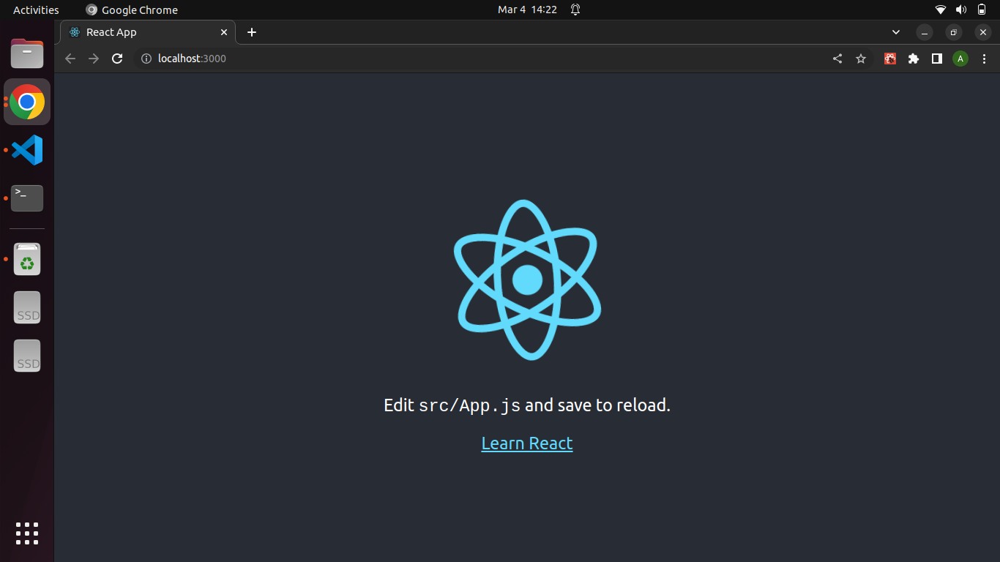
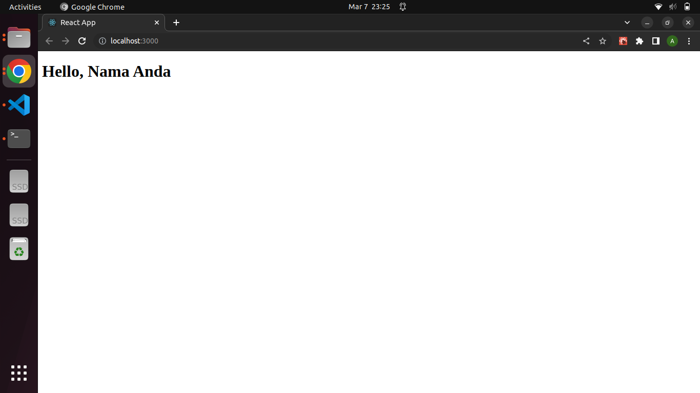
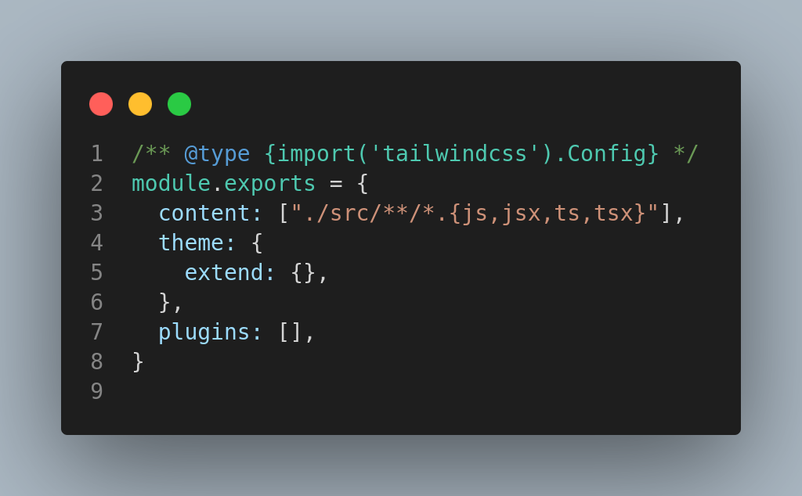
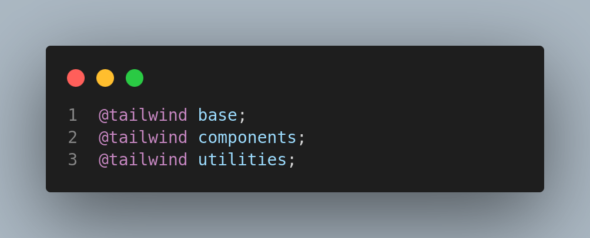
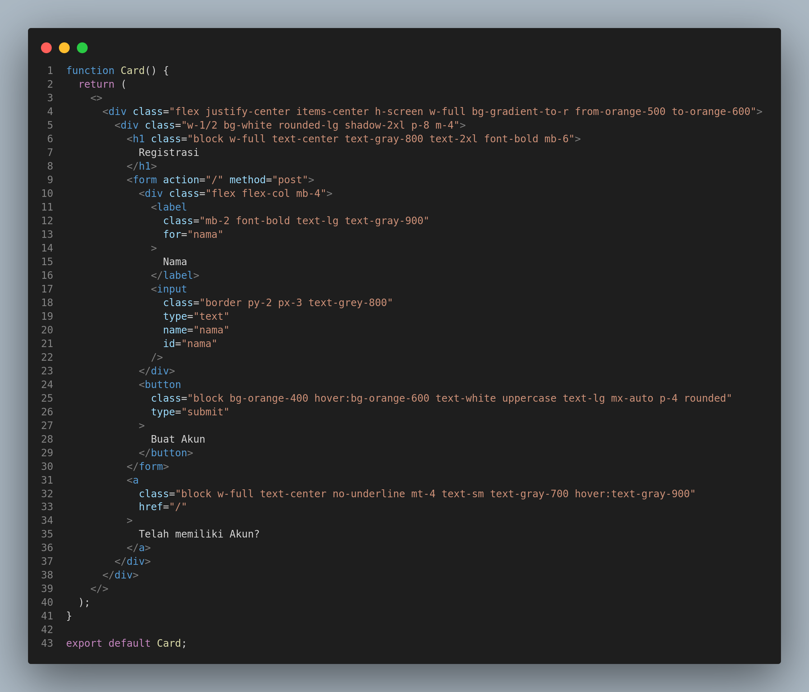
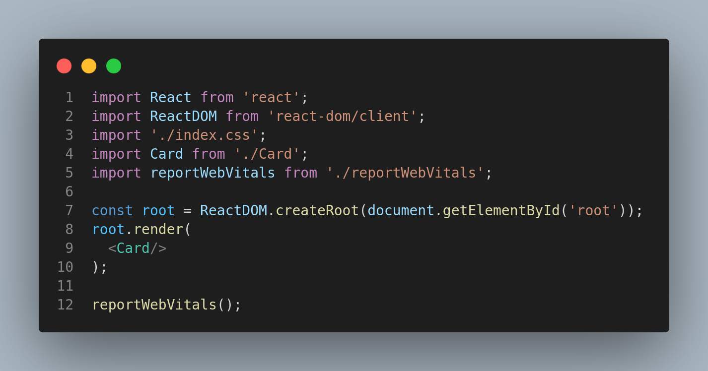
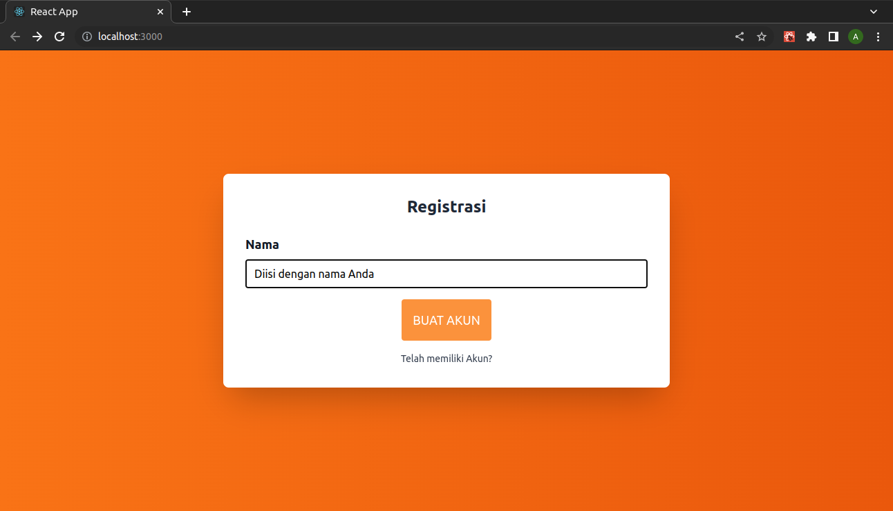

# Pertemuan 1

## 1. Instalasi

Yang Perlu diinstall

#### 1.1. NodeJS

Bisa didownload pada https://nodejs.org/en/download/

Untuk windows pilih versi windows Installer (.MSI) 64 bit secara umum dan 32 bit apabila menggunakan windows 32 bit

#### 1.2. Visual Studio Code

Bisa didownload pada https://code.visualstudio.com/Download sesuaikan dengan sisetem anda

#### 1.3. Visual Studio Code Extesion

1. Web Dev
2. Front-End React Pack

## 2.Membuat Project React Baru

### 2.1. Membuat Folder Workspace

Buatlah sebuah folder dan disarankan huruf kecil dengan nama **kuliah-react**. baiknya berada pada root drive, contoh `c:\kuliah-react` ataupun `d:\kuliah-react`

### 2.2. Menggunakan Create React App

Pada Command Prompt (Baik CMD/Powersehll/Terminal VS Code) pastikan mengarah ke alamat folder workspace (folder workspace menjadi folder root pada command prompt) contoh tampilan dalam command prompt `d:\kuliah-react>`

setelah itu buatlah sebuah project react baru dengan menggunakan perintah **npx create-react-app nama-project** contohya :

`npx create-react-app pertemuan01`

setelah itu buka Visual Studio Code dan pada Menu File > Open Folder pilih folder project yang telah dibuat sebelumnya.

setelah itu tampilkan terminal pada vscode. !!! PASTIKAN ALAMAT TERMINAL BERADA PADA ROOT FOLDER PROJECT YANG DIBUAT !!! contohnya

`d:\kuliah-react\pertemuan01>`

kemudian untuk menjalankan project react ketikkan perintah pada terminal

`npm start`

sehingga akan muncul project react pada browser anda



untuk menghentikan atau stop running aplikasi react, cukup dengan menekan tombol **CTRL** + **C** saat kursor berada di command prompt

# Pertemuan 2

## 1. Buat Project Baru

buatlah project baru dengan menggunakan perintah `npx create-react-app pertemuan02`

## 2. Buat File Hello.js

Dalam Folder **src**, buatlah file dengan nama **Hello.js**

kemudian pada file Hello.js ketikan kode seperti berikut ini

```
function Hello(){
    return(
        <h1>Hello, world</h1>
    );
}
export default Hello;
```

## 3. Integrasikan Hello.js ke index.js

kemudian integrasikan Hello ke dalam Index dengan cara memodifikasi file index.js degan mencari baris code di bawah ini

```
import App from './App';
```

dan diubah menjadi

```
import Hello from './Hello';
```

Setelah itu temukan baris perintah berikut ini

```
root.render(
  <React.StrictMode>
    <App />
  </React.StrictMode>
);
```

dan diubah menjadi

```
root.render(
  <Hello/>
);
```

## 4. Menjalankan Aplikasi

pastikan terminal Anda berada pada root project **pertemuan02** kemudian jalankan perintah **npm start**

dengan hasil sebagai berikut ini


# Pertemuan 3

## 1. Buat Project Baru

buatlah project baru dengan menggunakan perintah `npx create-react-app pertemuan03`

## 2. Buat File Tiga.jsx

Dalam Folder **src**, buatlah file dengan nama **Tiga.jsx**

kemudian pada file Hello.js ketikan kode seperti berikut ini

```
const name = 'Nama Anda';
const element = <h1>Hello, {name}</h1>;
function Tiga(){
    return(
        element
    );
}
export default Tiga;
```

## 3. Integrasikan Tiga.jsx ke index.js

kemudian integrasikan Hello ke dalam Index dengan cara memodifikasi file index.js degan mencari baris code di bawah ini

```
import App from './App';
```

dan diubah menjadi

```
import Tiga from './Tiga';
```

Setelah itu temukan baris perintah berikut ini

```
root.render(
  <React.StrictMode>
    <App />
  </React.StrictMode>
);
```

dan diubah menjadi

```
root.render(
  <Tiga/>
);
```

## 4. Menjalankan Aplikasi

pastikan terminal Anda berada pada root project **pertemuan03** kemudian jalankan perintah **npm start**

dengan hasil sebagai berikut ini



# Pertemuan 4

## 1. Buat Folder Project

Buat sebuah folder project dengan nama **pertemuan04**

## 2. Index

Kemudian dalam folder tersebut buatlah sebuah file dengan nama **index.html** dan ketikan kode berikut ini

```
<!DOCTYPE html>
<html lang="en">
  <head>
    <meta charset="UTF-8" />
    <meta http-equiv="X-UA-Compatible" content="IE=edge" />
    <meta name="viewport" content="width=device-width, initial-scale=1.0" />
    <title>Alex</title>
  </head>
  <body>
<label for="">Nama :</label>
  <br>
   <input type="text"/>
   
  </body>
</html>

```

### 3. Run Live Preivew

Tekan **ctrl** + **shif** + **p** kemudian pilih preview

# Pertemuan 5

# 1. Buat Project React Baru

Buat project react baru dengan perintah npx create-react-app pertemuan05

Pada Command Prompt (Baik CMD/Powersehll/Terminal VS Code) pastikan mengarah ke alamat folder workspace (folder workspace menjadi folder root pada command prompt) contoh tampilan dalam command prompt `d:\kuliah-react>`

setelah itu buatlah sebuah project react baru dengan menggunakan perintah **npx create-react-app nama-project** contohya :

`npx create-react-app pertemuan05`

setelah itu buka Visual Studio Code dan pada Menu File > Open Folder pilih folder project yang telah dibuat sebelumnya.

setelah itu tampilkan terminal pada vscode. !!! PASTIKAN ALAMAT TERMINAL BERADA PADA ROOT FOLDER PROJECT YANG DIBUAT !!! contohnya

`d:\kuliah-react\pertemuan05>

Kemudian pada VS Code

# 2. Install Tailwindcss, PostCSS, dan Autoprefixer

Untuk tampilan kita akan menggunakan Tailwindcss. Pada ReactJs untuk dapat menggunakannya dengan baik perlu diinstall libreary tambahan berupa PostCSS dan Autoprefixer

### 2.1 Install

cara install Tailwindcss, PostCSS, dan Autoprefixer yaitu dengan mengetikan perintah `npm install -D tailwindcss postcss autoprefixer`

### 2.2 Inisialisasi Tailwindcss

cara konfigurasi Tailwindcss yaitu dengan menggunakan perintah `npx tailwindcss init -p` sehingga akan muncul file (digenerate otomatis) dengan nama **tailwind.config.js** pada root project

### 2.3 Konfigurasi Tailwindcss

Buka file **tailwind.config.js** kemudian konfigurasi code tersebut sehingga menjadi seperti berikut ini



### 2.4 Penambahan Directives

Pada file **src/index.css** ubah code menjadi seperti ini



## 3. Membuat Komponen Card

dalam folder src buat file dengan nama **Card.jsx** kemudian ketikkan code seperti ini



## 4. Konfigurasi index

Kemudian lakukan konfigurasi dengan mengubah seluruh isi pada file **src/index.js** seperti code berikut ini



## 5. Run

Kemudian run aplikasi dengan menjalankan perintah `npm start` dengan hasil pada browser seperti berikut ini





## 6. Modifikasi

Silahkan modifikasi Object Card.jsx dengan menambahkan data diri dan foto seperti data KTP (challenge pertemuan 04) kemudian run
